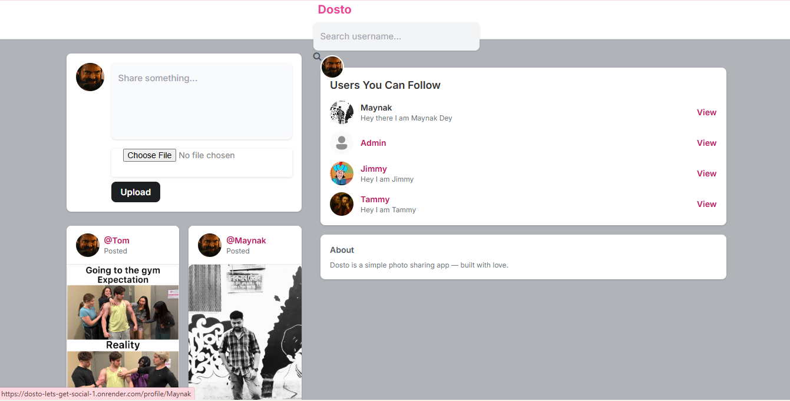
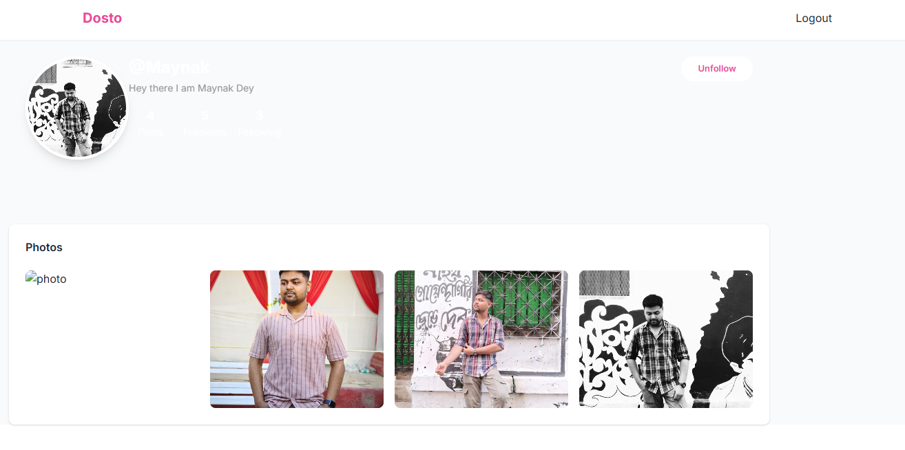
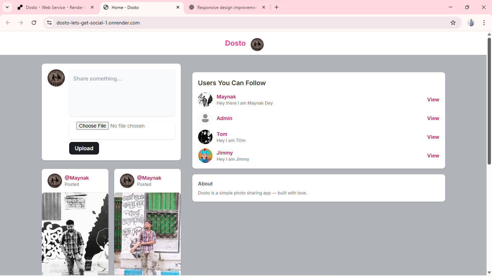

# 🌐 Dosto — Let’s Get Social

> A simple and modern **social media web app** built with **Django**, **HTML**, **CSS**, and **JavaScript**.


---

## 🧠 Overview

**Dosto — Let’s Get Social** is a community-driven social platform where users can connect, share posts, follow friends, and interact through likes.  
Built with Django and vanilla JavaScript, it focuses on simplicity, speed, and learning core web development concepts.

---

## ✨ Features

- 🔐 User Signup, Login & Logout (Django Authentication)
- 
- 🧑‍🤝‍🧑 Follow / Unfollow other users
- 
- 📝 Create, Edit, and Delete posts
- 
- ❤️ Like / Unlike posts
- 
- 🏠 Personalized feed showing followed users’ posts
- 
- 🖼️ Upload and view images with posts
- 
- 🔍 View user profiles
- 
- ⚙️ Admin panel for managing users and posts
- 
- 💻 Responsive frontend (HTML, CSS, JS)

---

## 🧩 Tech Stack

| Category | Technology |
|-----------|-------------|
| **Backend** | Django (Python) |
| **Frontend** | HTML5, CSS3, JavaScript |
| **Database** | SQLite (Development) |
| **Auth System** | Django’s built-in authentication |
| **Deployment (Planned)** | Render |
| **Version Control** | Git + GitHub |

---
## 🗂️ Project Structure

Dosto-lets-get-social/

│

├── Dosto/ # Main Django project config

│ ├── settings.py

│ ├── urls.py

│ └── ...

│

├── core/ # Main application (posts, profiles, follows)

│ ├── models.py

│ ├── views.py

│ ├── urls.py

│ ├── templates/core/

│ └── static/core/

│

├── media/ # Uploaded media files

├── static/ # Static assets (CSS, JS, images)

├── templates/ # Global templates

├── manage.py

└── db.sqlite3

---


---

## ⚙️ Getting Started

### 🔧 Prerequisites

- Python 3.x  
- pip  
- virtualenv (recommended)  

### 🪜 Installation

1. **Clone the repository**
   ```bash
   git clone https://github.com/maynak-dev/Dosto-lets-get-social.git
   cd Dosto-lets-get-social

2. **Create and activate virtual environment**
python -m venv venv
# On Windows
venv\Scripts\activate
# On Mac/Linux
source venv/bin/activate

3.**Install dependencies**
pip install -r requirements.txt

4.**Apply migrations**
python manage.py makemigrations
python manage.py migrate

5.**Create a superuser**
python manage.py runserver

6.**Run the server**
python manage.py runserver

7.**Open in browser**
http://127.0.0.1:8000/

🧑‍💻**Usage Guide**
| Action           | Description                               |
| ---------------- | ----------------------------------------- |
| 📝 Create Post   | Write text and optionally upload an image |
| ❤️ Like/Unlike   | Click the like button to toggle like      |
| 🔎 Explore Users | Visit others’ profiles                    |
| 🧑‍🤝‍🧑 Follow        | Follow or unfollow users                  |
| ⚙️ Admin Panel   | Manage users & content at `/admin/`       |

🖼️ **Screenshots**
| Home Page                                  | Profile Page                                     |
| ------------------------------------------ | ------------------------------------------------ |
|  |  |
| Login Page                                   | Post Feed                                  |
| -------------------------------------------- | ------------------------------------------ |
|  |  |

🚀 **Deployment**

This project is hosted on Render for public access.
Live link:
🔗 Coming Soon

💡 **Future Enhancements**

  -💬 Comment system  
  -🔔 Notifications (likes, follows, comments)  
  -📱 Mobile-friendly UI with modern design
  -🌙 Dark Mode
  -📨 Direct messaging / Chat feature
  -🔍 Search functionality
  -🧠 Recommendation engine (suggest users to follow)
🧾 **License**

This project is licensed under the MIT License — see the LICENSE
 file for details.

👨‍💻**Author**

**Maynak Dey**

📧 work.maynak@gmail.com

🌐 GitHub Profile(https://github.com/maynak-dev)
